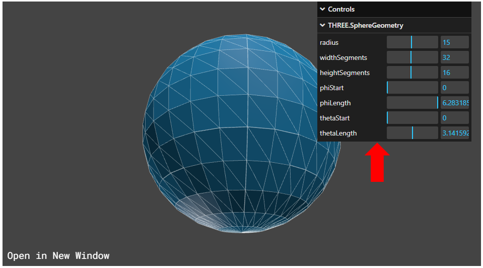

# 如何在 Vue 專案加入 Three.js 建立一個簡單的 3D 範例

> 開發環境
> Node.js 版本：18 以上
> Vue 版本：3.5.13
> Three.js 版本：0.172.0

## 1. 安裝 Three.js

Three.js 是一個獨立的函式庫，因此需要將其加入專案中。請在 Vue 專案目錄下打開終端機，輸入以下命令：

```bash
npm install three
```

## 2. Three.js 的簡介

在 **Three.js** 中，以下四個重要元素是構建 3D 圖形場景的核心組件。

### 1. 場景 (Scene)

場景是 Three.js 中的基礎容器，用於存放所有 3D 元素，例如物件、光源和相機。它可以被視為一個虛擬的 3D 空間，所有的物體都需要添加到場景中，才能被渲染器渲染出來。

- **功能**：
  - 保存所有 3D 元素。
  - 支援背景顏色或背景紋理的設置。
  - 支援霧效 (Fog) 的應用，用於模擬遠近物體的模糊效果。

- **使用範例**：
  ```javascript
  const scene = new THREE.Scene();
  scene.background = new THREE.Color(0x000000); // 設置背景為黑色
  ```

### 2. 相機 (Camera)

相機決定了場景的觀察方式，類似於人眼的視角。Three.js 提供了兩種主要的相機類型：

- **透視相機 (PerspectiveCamera)**：
  - 模擬人眼的視覺效果，物體越遠看起來越小。
  - 適用於 3D 場景的真實渲染。
  - 參數：
    - `fov`：視角 (Field of View)。
    - `aspect`：畫面比例。
    - `near` 和 `far`：可視範圍的最近和最遠距離。
  - 範例：
    ```javascript
    const camera = new THREE.PerspectiveCamera(75, window.innerWidth / window.innerHeight, 0.1, 1000);
    camera.position.set(0, 0, 5); // 設置相機位置
    ```

- **正交相機 (OrthographicCamera)**：
  - 不考慮透視效果，物體無論距離遠近，大小都相同。
  - 適用於 2D 場景或技術繪圖。
  - 範例：
    ```javascript
    const camera = new THREE.OrthographicCamera(-10, 10, 10, -10, 0.1, 1000);
    ```

### 3. 渲染器 (Renderer)

渲染器負責將 **場景** 和 **相機** 的內容轉換為 2D 圖像，並顯示在螢幕上。Three.js 中最常用的是 **WebGLRenderer**，它利用 WebGL 技術進行高效渲染。

- **功能**：
  - 處理光照、陰影、材質和紋理。
  - 將 3D 場景渲染到 HTML 的 `<canvas>` 元素中。

- **使用範例**：
  ```javascript
  const renderer = new THREE.WebGLRenderer();
  renderer.setSize(window.innerWidth, window.innerHeight); // 設置渲染器大小
  document.body.appendChild(renderer.domElement); // 將渲染器添加到網頁
  renderer.render(scene, camera); // 渲染場景和相機
  ```

### 4. 物件 (Object)

在場景中添加被觀察的物體。

#### 幾何體 (Geometry)

幾何體是物件的形狀基礎，定義了物體的頂點和面。Three.js 提供了多種內建幾何體，也支持自定義幾何體。

- **常見內建幾何體**：
  - **BoxGeometry**：立方體。
  - **SphereGeometry**：球體。
  - **PlaneGeometry**：平面。
  - **TorusGeometry**：圓環。
- **範例**：
  ```javascript
  const geometry = new THREE.BoxGeometry(1, 1, 1); // 創建一個立方體幾何體
  ```

#### 材質 (Material)

材質決定了物體的外觀，例如顏色、光澤度、透明度等。不同的材質適用於不同的渲染需求。

- **常見材質**：
  - **MeshBasicMaterial**：基礎材質，不受光照影響。
  - **MeshLambertMaterial**：漫反射材質，適合模擬柔和的光照效果。
  - **MeshPhongMaterial**：高光材質，適合模擬金屬或光滑表面。
  - **MeshStandardMaterial**：基於物理的材質，提供更真實的光照效果。
- **範例**：
  ```javascript
  const material = new THREE.MeshBasicMaterial({ color: 0x00ff00 }); // 綠色基礎材質
  ```

#### 網格模型 (Mesh)

網格模型是幾何體和材質的結合，用於創建可渲染的 3D 物體。

- **範例**：
  ```javascript
  const geometry = new THREE.BoxGeometry(1, 1, 1);
  const material = new THREE.MeshBasicMaterial({ color: 0x00ff00 });
  const cube = new THREE.Mesh(geometry, material); // 創建一個綠色立方體
  scene.add(cube); // 將立方體添加到場景中
  ```

## 3. 建立 Three.js 的元件

在 `src/components` 資料夾中建立一個新的元件，例如 `ThreeJsEx01.vue`，並實作 Three.js 的初始化邏輯。

```html
<template>
  <div ref="threeJsContainer"></div>
</template>

<script>
import * as THREE from 'three';

export default {
  name: "ThreeJsEx01",
  data() {
    return {
      camera: null,
      renderer: null,
    };
  },
  mounted() {
    this.initThreeJs();
    window.addEventListener('resize', this.onWindowResize);
  },
  methods: {
    /**
     * 初始化 Three.js
     */
    initThreeJs() {
      let scene, sphere;

      // 建立場景
      scene = new THREE.Scene();

      // 建立渲染器
      this.renderer = new THREE.WebGLRenderer();
      this.renderer.setSize(window.innerWidth, window.innerHeight); // 場景大小

      // 將渲染器的 DOM 綁到網頁上
      this.$refs.threeJsContainer.appendChild(this.renderer.domElement);

      // 建立相機
      this.camera = new THREE.PerspectiveCamera(
        45, // 視野 (FOV)
        window.innerWidth / window.innerHeight, // 寬高比 (Aspect Ratio)
        0.1,  // 近剪裁面 (Near Clipping Plane)
        100 // 遠剪裁面 (Far Clipping Plane)
      );

      // 建立物體
      const geometry = new THREE.SphereGeometry(1, 32, 32); // 幾何體
      const material = new THREE.MeshBasicMaterial({ color: 0x00ff00 }); // 材質
      sphere = new THREE.Mesh(geometry, material); // 建立網格物件
      scene.add(sphere);  // 將物體加入場景

      // 設定相機的位置，確保相機能看見場景中的物體
      this.camera.position.z = 5;

      // 建立動畫
      const animate = () => {
        sphere.rotation.x += 0.01; // 讓幾何體繞 X 軸旋轉
        sphere.rotation.y += 0.01; // 讓幾何體定繞 Y 軸旋轉

        // 使用 requestAnimationFrame 進行重繪
        requestAnimationFrame(animate);

        /**
         * 渲染場景和相機。
         * 使用 Three.js 的 renderer 將場景 (scene) 和相機 (camera) 渲染到畫布上。
         */
        this.renderer.render(scene, this.camera);
      };

      animate();
    },
    /**
     * 螢幕寬高改變時的事件
     */
    onWindowResize() {
      // 更新相機的長寬比為視窗的長寬比
      this.camera.aspect = window.innerWidth / window.innerHeight;

      // 並更新投影矩陣
      this.camera.updateProjectionMatrix();

      // 設定渲染器的大小為視窗的寬度和高度
      this.renderer.setSize(window.innerWidth, window.innerHeight);
    }
  },
  /**
   * 組件被銷毀時的事件
   */
  beforeDestroy() {
    window.removeEventListener('resize', this.onWindowResize);
    // ...existing code...
  }
};
</script>

<style scoped>
body {
  margin: 0;
  overflow: hidden;
}
</style>
```

### 步驟解析

#### 1. 建立模板結構

在模板部分，我們建立了一個 `div`，並使用 `ref` 指定名稱為 `threeJsContainer`。這個 `div` 將用來掛載 Three.js 渲染的內容。

```html
<template>
  <div ref="threeJsContainer"></div>
</template>
```

#### 2. 匯入 Three.js 並設置資料結構

在腳本部分，首先匯入 Three.js。接著，我們使用 `data()` 定義了 `camera` 和 `renderer`，這兩個變數分別代表**相機**與**渲染器**。

```javascript
import * as THREE from 'three';

data() {
  return {
    camera: null,
    renderer: null,
  };
}
```

#### 3. 初始化 Three.js

在 `mounted()` 生命週期鉤子中，我們呼叫 `initThreeJs()` 方法進行初始化，並監聽視窗大小變化的事件。

```javascript
mounted() {
  this.initThreeJs();
  window.addEventListener('resize', this.onWindowResize);
}
```

#### 4. 初始化場景、相機與渲染器

以下是 `initThreeJs()` 方法的關鍵步驟：

(1) **建立場景**

使用 `THREE.Scene()` 建立場景，用於容納 3D 物體。

```javascript
let scene = new THREE.Scene();
```

(2) **建立渲染器並掛載到網頁**

`WebGLRenderer` 負責將場景渲染到畫布上。

```javascript
this.renderer = new THREE.WebGLRenderer();
this.renderer.setSize(window.innerWidth, window.innerHeight);
this.$refs.threeJsContainer.appendChild(this.renderer.domElement);
```

(3) **建立相機**

`PerspectiveCamera` 是 Three.js 最常用的相機類型。

```javascript
this.camera = new THREE.PerspectiveCamera(45, window.innerWidth / window.innerHeight, 0.1, 100);
this.camera.position.z = 5;
```

(4) **建立幾何體與材質**

- `SphereGeometry` 用於生成球體幾何。
- `MeshBasicMaterial` 用於為幾何體提供基本材質。

```javascript
const geometry = new THREE.SphereGeometry(1, 32, 32);
const material = new THREE.MeshBasicMaterial({ color: 0x00ff00 });
const sphere = new THREE.Mesh(geometry, material);
scene.add(sphere);
```

程式碼中

- [SphereGeometry(radius : Float, widthSegments : Integer, heightSegments : Integer)](https://threejs.org/docs/index.html#api/zh/geometries/SphereGeometry) 建構子參數：
  - radius：球體半徑，預設值為 1。
  - widthSegments：水準分段數（沿著經線分段），最小值為 3，預設值為 32。
  - heightSegments：垂直分段數（沿著緯線分段），最小值為 2，預設值為 16。

可以透過官網提供工具，調整相關參數來模擬



- [MeshBasicMaterial( parameters : Object )](https://threejs.org/docs/index.html#api/zh/materials/MeshBasicMaterial) 建構子參數(可選)用於定義材質外觀的物件，具有一個或多個屬性。材質的任何屬性都可以從此處傳入(包括從Material繼承的任何屬性)。

可以透過官網提供工具，調整相關參數來模擬


#### 5. 動畫與渲染

使用 `requestAnimationFrame` 建立動畫迴圈，讓物體旋轉並更新畫面。

```javascript
const animate = () => {
  sphere.rotation.x += 0.01;
  sphere.rotation.y += 0.01;
  requestAnimationFrame(animate);
  this.renderer.render(scene, this.camera);
};

animate();
```

#### 6. 視窗大小調整處理

當視窗大小改變時，我們需要更新相機的寬高比，並重新設置渲染器的大小。

```javascript
onWindowResize() {
  this.camera.aspect = window.innerWidth / window.innerHeight;
  this.camera.updateProjectionMatrix();
  this.renderer.setSize(window.innerWidth, window.innerHeight);
}
```

#### 7. 清理事件監聽器

在組件銷毀前，移除視窗大小變化的監聽器，避免記憶體洩漏。

```javascript
beforeDestroy() {
  window.removeEventListener('resize', this.onWindowResize);
}
```

---

## 4. 將元件加入主頁面

在 `App.vue` 或其他頁面中使用這個元件。

```html
<script setup>
import ThreeJsEx01 from './components/ThreeJsEx01.vue'
</script>

<template>
  <ThreeJsEx01></ThreeJsEx01>
</template>

<style scoped>
</style>
```

在 `main.js` 中，移除 `style.css`

```js
import { createApp } from 'vue'
// import './style.css'
import App from './App.vue'

createApp(App).mount('#app')
```

## 5. 執行專案

啟動開發伺服器，檢視效果。

```bash
npm run dev
```

打開瀏覽器，應該能看到一個旋轉的綠色球體。

## 完整效果

運行此程式碼後，你將在瀏覽器中看到一個綠色的球體，它會持續繞 X 與 Y 軸旋轉，並且視窗大小變化時能動態調整。


## 主要學習成果

1. 整合 Vue 生命週期，根據需要在 Vue 的 `beforeUnmount` 中釋放資源，避免記憶體洩漏。
2. 以上步驟能幫助你在 Vue 專案中成功整合 Three.js。如果需要更進階的實現，例如載入 3D 模型或動畫系統，可以再深入討論！
