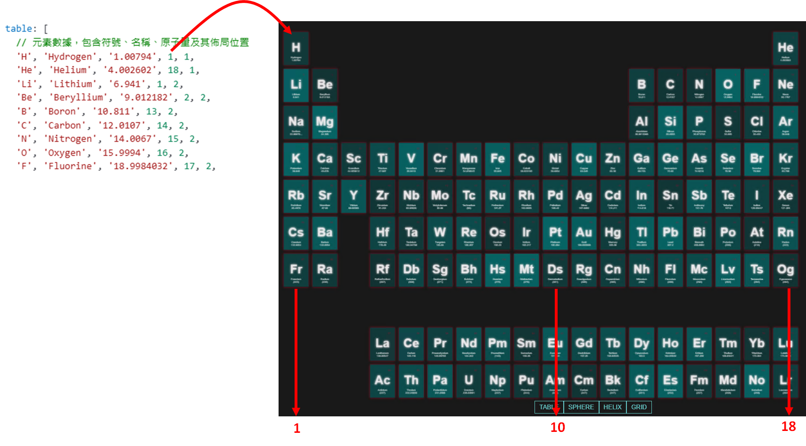
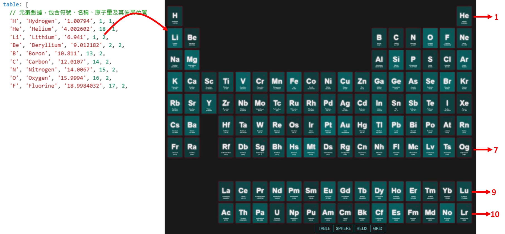
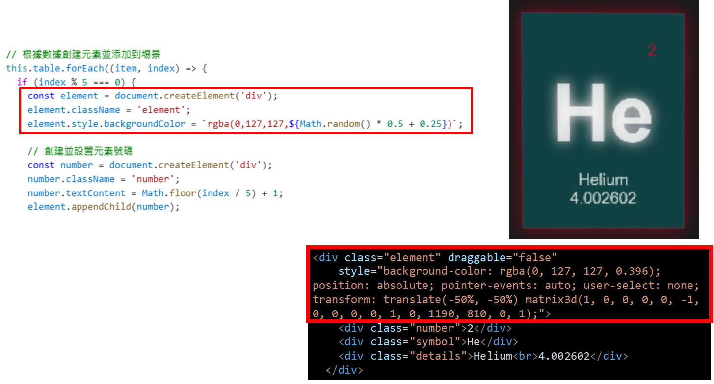
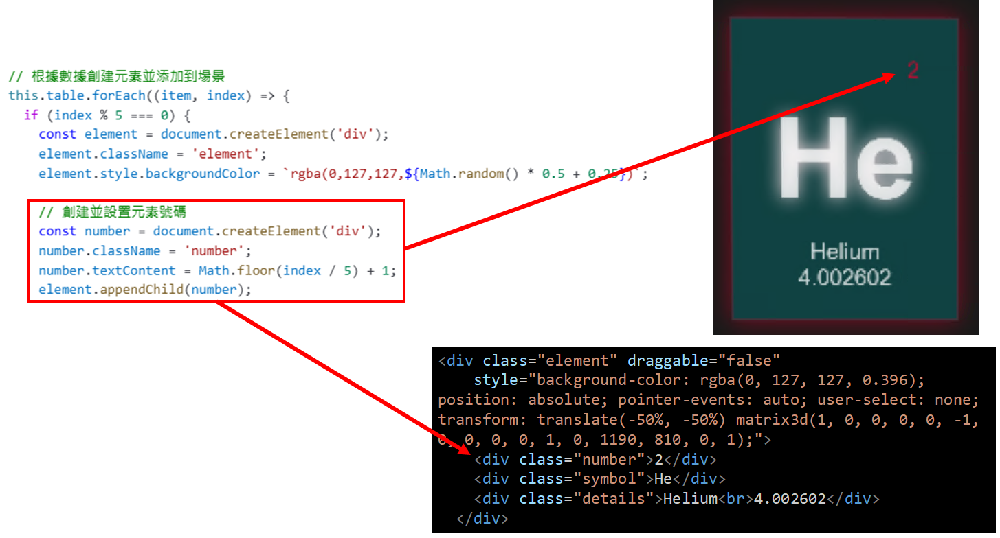
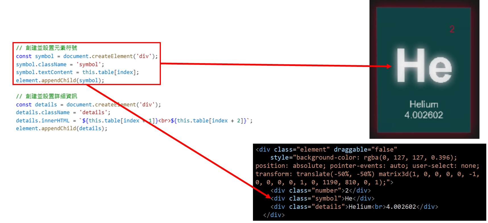
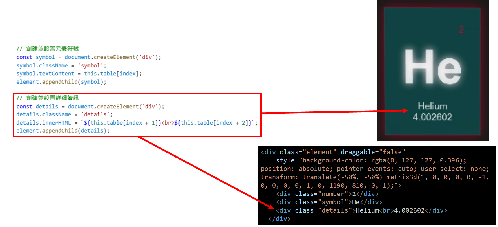

# 使用 Vue 3 和 Three.js 創建 CSS3D 元素週期表動畫教學

## 前言

這篇文章將帶你一步步學習如何在 Vue 3 中使用 Three.js 和相關附加功能來創建一個 CSS 3D 的週期表動畫專案。該專案展示了元素的不同佈局（表格、球體、螺旋和網格），並通過動畫平滑地切換。

## 建立 Vue 3 專案並安裝依賴

首先，建立一個 Vue 3 專案並安裝以下依賴：

1. **Three.js** - 三維渲染核心庫
2. **@tweenjs/tween.js** - 用於動畫插值的庫

在專案目錄中執行以下指令：
```bash
npm install three @tweenjs/tween.js
```

## 程式碼架構解析

這裡是完整的程式碼架構：

1. **template** - 定義 DOM 結構，包括顯示內容和按鈕。
2. **script** - 處理 Three.js 的邏輯，包含渲染、動畫和場景初始化。
3. **style** - 美化元素外觀。

接下來，我們將逐步拆解並解釋每一部分的實現。

## Template 部分

這段程式碼定義了：
- 顯示專案名稱的 `info` 區塊。
- 用於渲染 Three.js 的 `container` 區塊。
- 一組按鈕，用於切換不同的動畫佈局。

```html
<template>
  <div id="info">
    <a href="https://threejs.org" target="_blank" rel="noopener">three.js</a> css3d - periodic table.
  </div>
  <div id="container" ref="container"></div>
  <div id="menu">
    <button @click="transform(targets.table, 2000)">TABLE</button>
    <button @click="transform(targets.sphere, 2000)">SPHERE</button>
    <button @click="transform(targets.helix, 2000)">HELIX</button>
    <button @click="transform(targets.grid, 2000)">GRID</button>
  </div>
</template>
```

`container` 是三維場景的渲染目標，並使用 Vue 的 `ref` 將 DOM 元素與 JavaScript 進行綁定。

## Script 部分

Script 是核心邏輯部分，分為以下幾個關鍵區塊：

### 1. Data 定義

```javascript
data() {
  return {
    camera: null,
    scene: null,
    renderer: null,
    controls: null,
    objects: [],
    targets: { table: [], sphere: [], helix: [], grid: [] },
    table: [
      'H', 'Hydrogen', '1.00794', 1, 1,
      'He', 'Helium', '4.002602', 18, 1,
      ... // 其他元素數據
    ]
  };
}
```

- `camera`、`scene`、`renderer` 是 Three.js 場景的核心對象。
- `objects` 存儲所有渲染的 3D 物件。
- `targets` 定義四種不同佈局的目標位置。
- `table` 包含週期表數據。

### 2. 初始化場景

在 `init` 方法中：

#### 相機初始化

```javascript
this.camera = new THREE.PerspectiveCamera(40, window.innerWidth / window.innerHeight, 1, 10000);
this.camera.position.z = 3000;
```

- 定義透視相機，設置視角和距離。

#### 場景和渲染器

```javascript
this.scene = new THREE.Scene();
this.renderer = new CSS3DRenderer();
this.renderer.setSize(window.innerWidth, window.innerHeight);
this.$refs.container.appendChild(this.renderer.domElement);
```

- 建立場景和 CSS 3D 渲染器。
- 將渲染器掛載到 DOM。

#### 建立 3D 元素

```javascript
this.table.forEach((item, index) => {
  if (index % 5 === 0) {
    const element = document.createElement('div');
    element.className = 'element';
    element.style.backgroundColor = `rgba(0,127,127,${Math.random() * 0.5 + 0.25})`;
    ... // 添加數字、符號、詳情

    const objectCSS = new CSS3DObject(element);
    objectCSS.position.x = Math.random() * 4000 - 2000;
    objectCSS.position.y = Math.random() * 4000 - 2000;
    objectCSS.position.z = Math.random() * 4000 - 2000;
    this.scene.add(objectCSS);

    this.objects.push(objectCSS);
  }
});
```
- 根據 `table` 數據創建 DOM 結構，並通過 `CSS3DObject` 將其轉換為 3D 元素。
- `if (index % 5 === 0)` 的用途是確保只有每組 5 個元素中的第一個元素被處理。`this.table` 中的數據以每 5 個元素為一組，分別表示**符號**、**名稱**、**原子量**、**行**和**列**的位置資訊。因此，這個條件用來篩選每組的第一個元素（即符號）來進行後續的 DOM 操作和 3D 場景處理。

在這裡，陣列第一行中的 `'H', 'Hydrogen', '1.00794',` 部分是作為 HTML + CSS 元素的資訊，而 `1, 1,` 則表示在 3D 空間中的位置（氫元素對應於週期表的第 1 列、第 1 行）。





使用 JavaScript 生成 HTML + CSS 元素，可以使用 `document.createElement()` 方法，並在之後定義類別與 CSS。

在範例中，用於生成 HTML + CSS 的程式碼如下所示。









執行的流程如下：

- 使用 `document.createElement()` 生成元素。
- 為生成的元素分別指定內容。
- 當需要嵌套元素時，使用 `appendChild()` 進行指定。

根據上述程式碼，對於氫元素 H，生成的最終 HTML 應如下所示：\
只要清楚自己最終需要的HTML結構，進行修改應該不會太困難。

```html
<div class="element" style="background-color:rgba(0,127,127,※random)">
    <div class="number">1</div>
    <div class="symbol">H</div>
    <div class="details">Hydrogen<br>1.00794</div>
</div>
```

### 3. 佈局和動畫

```javascript
createLayouts() {
  this.objects.forEach((_, i) => {
    // Sphere 布局
    const phi = Math.acos(-1 + (2 * i) / this.objects.length);
    const theta = Math.sqrt(this.objects.length * Math.PI) * phi;
    const objectSphere = new THREE.Object3D();
    objectSphere.position.setFromSphericalCoords(800, phi, theta);
    this.targets.sphere.push(objectSphere);

    ... // Helix 和 Grid 的計算
  });
}

transform(targets, duration) {
  TWEEN.removeAll();
  this.objects.forEach((object, i) => {
    const target = targets[i];
    new TWEEN.Tween(object.position)
      .to({ x: target.position.x, y: target.position.y, z: target.position.z }, duration)
      .easing(TWEEN.Easing.Exponential.InOut)
      .start();
  });
}
```

- `createLayouts` 方法計算四種佈局的目標位置。
- `transform` 方法將物件從當前位置平滑過渡到目標佈局。

### 4. 動畫驅動

```javascript
animate() {
  requestAnimationFrame(this.animate);
  TWEEN.update();
  this.controls.update();
}
```

- 使用 `requestAnimationFrame` 進行動畫更新。
- 通過 TWEEN 和控制器實現動態效果。

## Style 部分

以下是部分 CSS，主要用於美化元素外觀：

在 CSS 中，必須修改的是 3D 顯示元素的尺寸。尺寸為 120x160。

```css
.element {
  width: 120px;
  height: 160px;
  box-shadow: 0px 0px 12px rgba(0,255,255,0.5);
  border: 1px solid rgba(127,255,255,0.25);
  text-align: center;
}

button {
  color: rgba(127,255,255,0.75);
  background: transparent;
  border: 0px;
}
```

## 結論

這篇教學展示了如何使用 Vue 3 與 Three.js 結合，創建 CSS3D 元素的動畫效果。希望你能通過本教學掌握相關技術，並拓展到更多的 Three.js 應用場景。

###### 相關文章

- [three.js examples](https://threejs.org/examples/#css3d_periodictable)
- [three.js/examples/css3d_periodictable.html at master · mrdoob/three.js](https://github.com/mrdoob/three.js/blob/master/examples/css3d_periodictable.html)
- [THREE.JS periodic table 응용](https://codepen.io/wimmwell/pen/GRxEJXd)
- [Three.js Tutorial: How to make a periodic table | by Sajad Asadi | Aratta Studios | Medium](https://medium.com/aratta-studios/three-js-tutorial-how-to-make-a-periodic-table-99be4c772117)
